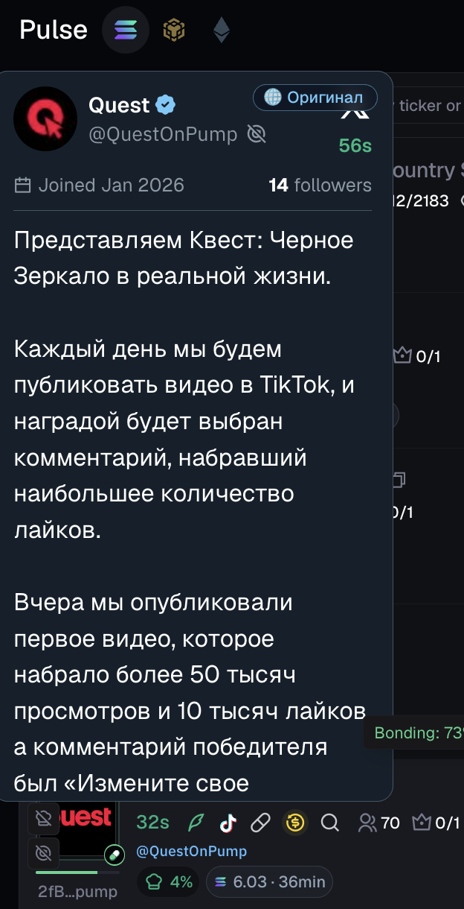

# Axiom Translator

Chrome extension that auto-translates tweets, account bios, and community descriptions into Russian — while preserving HTML markup and keeping links untouched.

## What it does

- Detects tweet, account, and community popups
- Auto-translates text to Russian on popup appear
- Skips text that's already in Russian (Cyrillic detection)
- Never translates link text — URLs stay original
- Toggle button inside each popup to switch between translation and original
- Sticky button in the bottom-right corner for quick toggling while scrolling

## How it works

Translation is handled by the background service worker via Google Translate's public API (`translate.googleapis.com`). Results are cached per session so the same text is never fetched twice.

## Installation

1. Clone or download this repo
2. Open Chrome → `chrome://extensions`
3. Enable **Developer mode** (top right)
4. Click **Load unpacked** and select this folder

## Files

| File | Description |
|------|-------------|
| `manifest.json` | Extension manifest (MV3) |
| `content.js` | Popup detection, DOM translation, toggle buttons |
| `background.js` | Service worker — fetches translations from Google API |

---

❤️ If this extension is useful to you, you can say thanks with a SOL donation:
`7qmeYezpVaYpnaq6t9D4XH3Q9AYSuF264p66MbHX3ERt`
